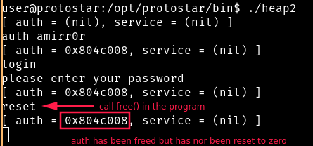
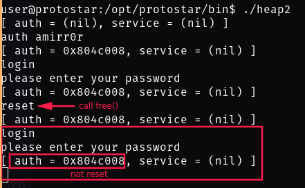

# Heap 2

This level examines what can happen when heap pointers are stale.

This level is completed when you see the "you have logged in already!" message

This level is at `/opt/protostar/bin/heap2`

```c
#include <stdlib.h>
#include <unistd.h>
#include <string.h>
#include <sys/types.h>
#include <stdio.h>

struct auth {
  char name[32];
  int auth;
};

struct auth *auth;
char *service;

int main(int argc, char **argv)
{
  char line[128];

  while(1) {
    printf("[ auth = %p, service = %p ]\n", auth, service);

    if(fgets(line, sizeof(line), stdin) == NULL) break;
    
    if(strncmp(line, "auth ", 5) == 0) {
      auth = malloc(sizeof(auth));
      memset(auth, 0, sizeof(auth));
      if(strlen(line + 5) < 31) {
        strcpy(auth->name, line + 5);
      }
    }
    if(strncmp(line, "reset", 5) == 0) {
      free(auth);
    }
    if(strncmp(line, "service", 6) == 0) {
      service = strdup(line + 7);
    }
    if(strncmp(line, "login", 5) == 0) {
      if(auth->auth) {
        printf("you have logged in already!\n");
      } else {
        printf("please enter your password\n");
      }
    }
  }
}
```

## Solution

In order to print `"you have logged in already!"` and complete this challenge, we need to exploit this **Use-after-free** vulnerability so that `auth->auth` will not be NULL.

This vulnerability appears when an area of the heap has not been reset to zero after being freed but is nevertheless handled in the rest of the program.

Indeed we can see that even after the `free()` function was called after sending "reset" to the program, `auth` is not reset to zero:

 

If we type "login" again `auth` is used despite the fact that it has been freed. This is a **Use-after-free** vulnerability.

 

Then if we type `service whatever` the `strdup()` function is called. Under the hood, `strdup()` uses `malloc()` to allocate a new chunk and duplicate the string.
As you can see, `service` and `auth` now point to the same address: 

```
service whatever
[ auth = 0x804c008, service = 0x804c008 ]
```

They point to the same address because the chunk was considered free.

So how can we exploit that ?

Actually, this code above is horrible, the structure is called `auth`, it has a variable called `auth` and its instance is also called `auth`.

So we can simply run this and we complete this challenge:

```
service AAAAAAAAAAAAAAAAAAAAAAAAAAAAAAAAAAAAAAAAAAA
[ auth = 0x804c008, service = 0x804c018 ]
login
you have logged in already!
[ auth = 0x804c008, service = 0x804c018 ]
```